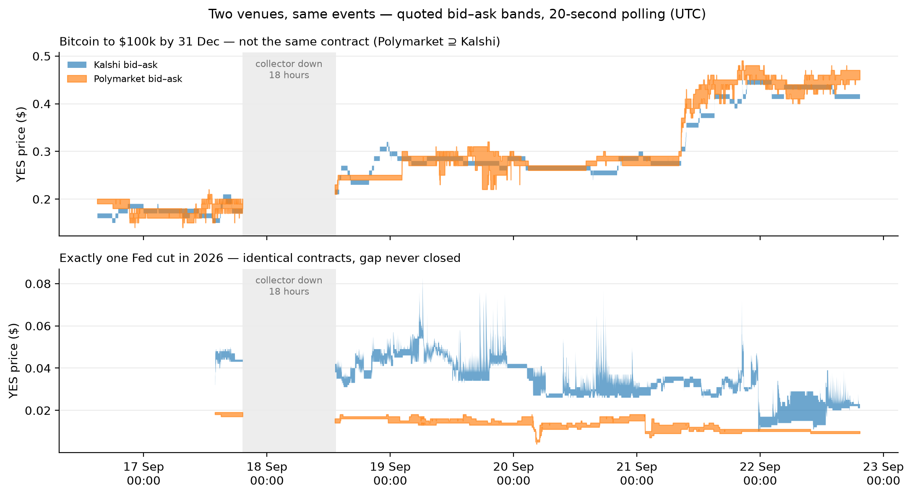
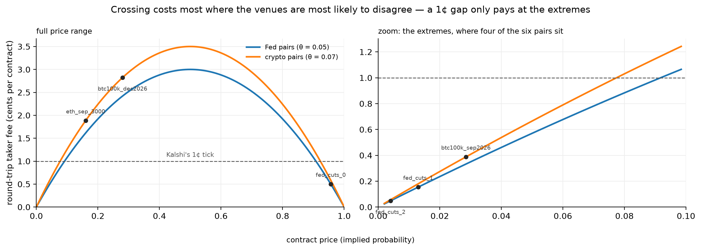
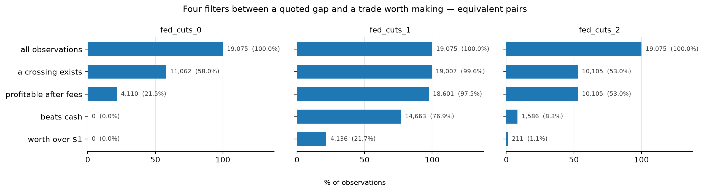
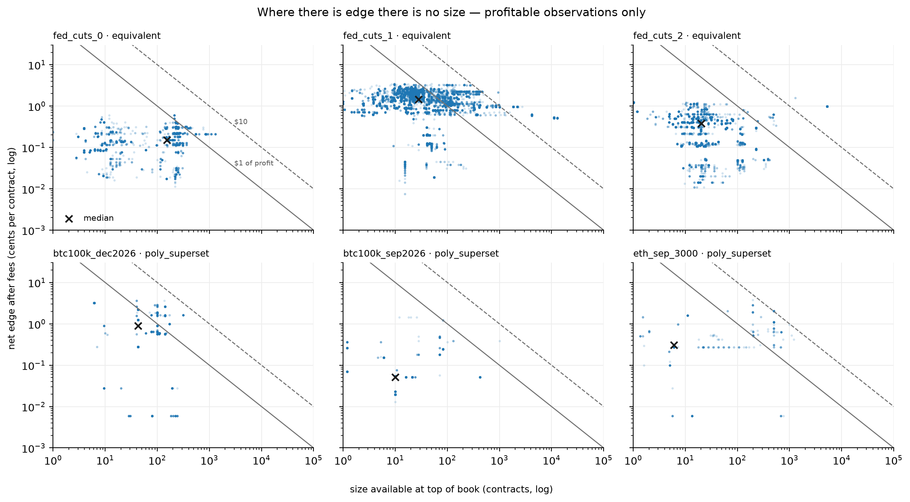
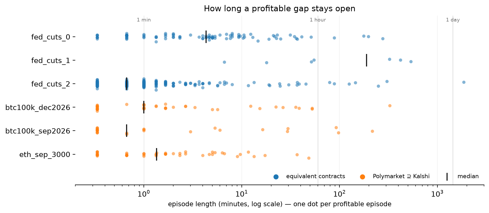

# Cross-Venue Microstructure of Binary Event Contracts

**Do price differences between Kalshi and Polymarket survive fees, capital cost and order-book
depth — and are the two contracts even the same claim?**

Two prediction-market venues list contracts on the same real-world events: the same Fed decision,
the same Bitcoin threshold. Their prices differ, sometimes by several cents, for hours at a time.
This project polls both venues' public order books every 20 seconds and asks whether any of that
divergence was ever worth trading.

**Six matched markets, six days, 281,000 quote snapshots and 1.4 million order-book rows. Nothing
survived.** The best opportunity in the dataset — a gap on identical contracts that stayed
profitable for 3.4 days straight — was worth a median of **38 cents** at a time.

## Scope

**Public, read-only market data only. No trading, no order placement, no positions, no account
funding.** Both venues publish unauthenticated market-data endpoints; this project reads them and
nothing else.

The study measures the *size* and *persistence* of divergence. It does not claim risk-free profit,
and at a 20-second cadence it cannot and does not measure latency or which venue leads the other.

---

## The result

Four filters stand between a quoted gap and a trade worth making — and one question comes before
all four.

### 0. Are the two contracts the same claim?

Half the pairs are not. Each pair was classified by reading both venues' full published rulebooks —
`rules_primary` **and** `rules_secondary` on Kalshi, `description` on Polymarket.

| pairs | classification | why |
|---|---|---|
| Fed rate-cut count ×3 | **equivalent** | same event, same counting rule (25bp = one cut), same resolution source |
| Bitcoin ×2, Ethereum ×1 | **Polymarket ⊇ Kalshi** | Kalshi settles on a *trimmed mean* of the CF Benchmarks index — multi-exchange, USD, strictly "above". Polymarket settles on the **high** of any one-minute Binance candle — one exchange, USDT, "equal to or greater" |

A brief spike on Binance resolves the Polymarket contract YES and leaves the Kalshi one open, so
Polymarket's contract is worth strictly more. Ethereum's gap runs in exactly that direction: 89% of
its profitable crossings are sell-Polymarket / buy-Kalshi — a trade that loses **both** legs when a
spike prints, which makes it payment for spike risk rather than arbitrage. Bitcoin's does not. Its
crossings split 52/48 between directions and the December gap changed sign twice in a week.

**Classifying the contracts explains some gaps and not others.** It is a necessary step, not a
sufficient one — and it is why the four filters below are applied to the three *equivalent* pairs,
where a gap really is the same dollar priced twice.



*Two venues, same events. Top: the Bitcoin pair, where the contracts differ and the gap changes
sign. Bottom: identical Fed contracts, where the two bands never touch for six days.*

### 1. Is there a crossing?

Often. The gap that matters is between what you can *sell* at on one venue and *buy* at on the
other — `max(bid_a − ask_b, bid_b − ask_a, 0)`, never `mid_a − mid_b`. On that definition
`fed_cuts_1` crossed in **99.6%** of 19,075 observations and `fed_cuts_0` in 58%.

### 2. Does it survive fees?

Both venues charge takers a fee proportional to `P × (1 − P)` — the Bernoulli variance — so crossing
costs most at 50¢ and almost nothing at the extremes. Kalshi rounds its fee **up** to the next cent.

| price | Kalshi fee | Polymarket fee (θ = 0.05) | gap needed to break even |
|---:|---:|---:|---:|
| 0.82 | 1.03¢ | 0.74¢ | **1.77¢** |
| 0.70 | 1.47¢ | 1.05¢ | **2.52¢** |
| 0.50 | 1.75¢ | 1.25¢ | **3.00¢** |

Kalshi quotes in whole cents, so divergence can only appear there in 1¢ steps. A 1¢ gap is
structurally unprofitable anywhere between roughly 9% and 91% — and that band contains every price
at which two venues with different trader populations are most likely to disagree. That is a
limits-to-arbitrage mechanism, not an accident.



*The cost of crossing peaks exactly where disagreement is most likely. Four of the six pairs trade
out at the extremes, where a single Kalshi tick clears the cost — which is why crossings appear
there at all.*

Fees cut `fed_cuts_0` from 11,062 crossings to 4,110 profitable observations.

### 3. Does it beat cash?

This is the filter most write-ups skip. Capturing a cross-venue gap means buying YES on one venue
**and** NO on the other, posting collateral for both: about `k_ask + (1 − p_bid) ≈ $1` per contract
pair, locked until the market resolves. The position pays exactly $1 at resolution, so **the return
is an interest rate**, and it has to beat the ~3.25% a year paid on an idle Kalshi balance over the
same holding period. Cents per contract is the wrong unit.

- **`fed_cuts_0`: 0 of 4,110 profitable observations beat cash.** Not one, in six days. Its best
  observation annualises to 2.14% against 3.25% on cash.
- **`fed_cuts_2`: 8.3%** of observations clear it.
- **`fed_cuts_1`: 76.9%** — the only pair in the study that reliably clears this filter, with a
  median raw return of 1.49% over 102 days against 0.91% from cash.



*Each equivalent pair dies at a different filter, and all three die.*

### 4. Is there size behind it?

No. Size on a crossing is the smaller of the two sides being traded into, and at top of book that is
usually tens of contracts.

`fed_cuts_1`, the pair that clears every earlier filter, offers a median of **28 contracts** at a
median profit of **38 cents** per snapshot. Its best single snapshot in six days was $66.88. To earn
$1,000 at its median rate you would need roughly $67,000 of capital tied up for 102 days — and the
book offers about $28 of it at a time.



*Log–log; the diagonals mark $1 and $10 of profit. Most observations in every panel sit below the
$1 line. Where there is edge there is no size, and where there is size there is no edge.*

### And it is not a speed race

Gaps are not disappearing before anyone can reach them. Episodes — runs of consecutive observations
that are profitable after fees, split at any collection gap over 60 seconds — last minutes to days:

- `fed_cuts_1` stayed continuously profitable for **3.4 days** (4,885 minutes) in its longest episode.
- `fed_cuts_2`'s longest ran 1.3 days.
- In every pair, most profitable *time* sits in episodes lasting 10 minutes or more (58–100%).



*One dot per profitable episode. Equivalent pairs sit to the right; the crypto pairs pile up at the
20-second floor.*

**So the divergence persists because it is not worth anyone's time to close — not because it closes
too fast, and not, for the Fed pairs, because the contracts differ.** That is a limits-to-arbitrage
result, measured rather than asserted.

---

## Results

All numbers from 16–22 September 2026 (see *Data completeness*). Prices are the median Polymarket
mid over the window; "raw" is the return from entry to resolution, "cash" is what an idle balance
earns over the same days.

| pair | class | price | crossing | profitable | beats cash | median raw vs cash | median size | median profit | best snapshot |
|---|---|---:|---:|---:|---:|---|---:|---:|---:|
| `fed_cuts_0` | equivalent | 0.957 | 58.0% | 21.5% | **0.0%** | 0.15% vs 0.92% | 153 | $0.09 | $2.78 |
| `fed_cuts_1` | equivalent | 0.013 | 99.6% | 97.5% | 76.9% | 1.49% vs 0.91% | 28 | $0.38 | $66.88 |
| `fed_cuts_2` | equivalent | 0.004 | 53.0% | 53.0% | 8.3% | 0.39% vs 0.90% | 20 | $0.06 | $52.21 |
| `btc100k_dec2026` | Poly ⊇ Kalshi | 0.280 | 32.3% | 7.9% | 4.1% | 0.94% vs 0.93% | 43 | $0.57 | $5.09 |
| `btc100k_sep2026` | Poly ⊇ Kalshi | 0.029 | 9.4% | 6.5% | 1.9% | 0.05% vs 0.09% | 10 | $0.00 | $3.86 |
| `eth_sep_3000` | Poly ⊇ Kalshi | 0.160 | 16.6% | 3.2% | 3.0% | 0.31% vs 0.12% | 6 | $0.02 | $10.18 |

**With confidence intervals.** 20-second observations are heavily autocorrelated, so intervals come
from a **block bootstrap** — resampling whole 6-hour blocks, 1,000 times — never iid standard
errors. Treating the rows as independent would have reported `btc100k_dec2026` as 7.9% ± 0.3
points — an interval sixteen times narrower than the honest one.

| pair | crossing % [95%] | profitable % [95%] | median annualised % [95%] |
|---|---|---|---|
| `fed_cuts_0` | 58.0 [42.9, 72.6] | 21.6 [11.0, 32.8] | 0.54 [0.41, 0.66] |
| `fed_cuts_1` | 99.6 [99.0, 100.0] | 97.5 [92.9, 100.0] | 5.27 [3.68, 6.67] |
| `fed_cuts_2` | 53.0 [34.6, 71.3] | 53.0 [34.6, 71.3] | 1.40 [0.48, 1.74] |
| `btc100k_dec2026` | 32.4 [22.1, 44.1] | 7.9 [2.8, 13.8] | 3.38 [1.01, 7.16] |
| `btc100k_sep2026` | 9.4 [4.5, 14.7] | 6.5 [2.3, 11.2] | 1.34 [0.74, 8.27] |
| `eth_sep_3000` | 16.7 [8.9, 25.9] | 3.2 [0.6, 7.3] | 8.53 [3.04, 32.68] |

Two readings that matter. The percentages are only roughly known — six days hold few independent
stretches, and the intervals say so. But the conclusion does not rest on them: `fed_cuts_0`'s
median annualised return is 0.54% with an upper bound of 0.66%, nowhere near cash, and no interval
changes a median profit of 38 cents.

Annualised figures are always reported beside raw ones, because annualising a short-dated trade
flatters it: `eth_sep_3000`'s "8.5% a year" is 0.31% over 13 days — three cents per $10 committed.

---

## Method

**Collection.** `collector.py` polls both venues every 20 seconds and writes to SQLite (WAL mode,
prices stored as text, never floats). Kalshi's `/markets` response carries top of book for every
market in one request, so all its quotes share a single timestamp; Polymarket has no batch book
endpoint, so its quotes are fetched per token and are smeared a few seconds within each cycle — a
known limitation, recorded rather than hidden. Full book depth (10 levels per side, both venues) is
captured every third cycle.

Kalshi's order book returns **bids only on both the YES and NO sides**, because a NO bid at price
*p* is a YES ask at *1 − p*; the best YES ask is therefore `1 − (best NO bid)`. Level-0 prices from
the book endpoint were checked against the top-of-book fields from `/markets` to confirm the
conversion.

**Joining.** As-of join, backward, 30-second staleness tolerance, no interpolation.

**Fees.** Kalshi taker `ceil(0.07 · C · P · (1−P))`, rounded up to the cent; Polymarket taker
`θ · C · P · (1−P)` with θ = 0.07 on crypto markets and 0.05 elsewhere. Both are modelled per
contract in the analysis.

**Equivalence.** Every pair classified from both venues' full rulebooks before any gap is
interpreted. This caught one hypothesis of mine that was wrong — Kalshi's one-line `rules_primary`
suggests it counts Fed *decisions*, which would have made the pairs non-equivalent, while
`rules_secondary` states plainly that 25bp equals one cut. The operative definition can live in the
secondary rules alone.

**Episodes.** Consecutive observations profitable after fees, **split at any collection gap over 60
seconds** — otherwise the 18-hour outage would have glued two episodes into one fake 18-hour
result, with no error to reveal it.

**Intervals.** Block bootstrap, 1,000 resamples, with a sensitivity check across 30-minute, 2-hour
and 6-hour blocks; the reported intervals use the widest (6-hour) blocks. Intervals roughly double
between 30-minute and 6-hour blocks, which is itself a measure of how long these gaps persist.

---

## Data completeness

- **Window:** 16 Sept 15:00 UTC – 22 Sept 19:30 UTC. Bitcoin pairs 128.9 observed hours; the Fed and
  Ethereum pairs, added on 17 Sept, 106.0 hours.
- **One interruption in six days:** an 18.0-hour laptop outage (17 Sept 19:18 – 18 Sept 13:16 UTC).
  Both venues stop at the same second, which identifies it as local rather than an API failure.
  Fixed by blocking idle sleep from inside the collector; **since the fix there has been no
  collection gap longer than 5 minutes.**
- **Capture rate:** Polymarket essentially every cycle; Kalshi 98.6–98.9% of cycles, the shortfall
  being transient SSL drops, each logged and retried once.
- 280,940 quote rows and 1,404,288 book rows, including three football markets collected 15–17 Sept
  and excluded from the analysis.

## Limitations

- **Top of book only.** Every profit figure here is a best case; walking the book for more size can
  only worsen the fill.
- **Six days, six pairs.** The percentages describe this window, not a stable property of these
  markets; the intervals above are wide for that reason.
- **No execution.** Quoted size is not guaranteed fill, and the study never places an order.
- **20-second cadence.** Episodes shorter than one poll are invisible, and nothing here supports a
  claim about which venue leads.
- **One ambiguous rulebook.** Kalshi's Bitcoin secondary rule describes an all-period trimmed mean
  and an any-point trigger in consecutive sentences; this study takes the per-minute reading, which
  is what its Ethereum text states explicitly and what Kalshi's own prices imply.
- **Cross-venue execution is legally constrained** — Kalshi is US-only, Polymarket International
  excludes US residents — so for most participants the arbitrage is not merely unprofitable but
  unavailable.

## Running it

```bash
conda create -n crossvenue python=3.12 requests pandas matplotlib jupyterlab -y
conda activate crossvenue
python collector.py          # writes crossvenue.db; Ctrl+C to stop
```

No API keys. Both venues' market-data endpoints are public. `pairs.json` defines what is collected,
so markets can be added without touching code; `crossvenue.db` is created on first run and is not
committed. `01_probe.ipynb` is exploration, `02_analysis.ipynb` produces every number and figure in
this README, and `readme_numbers.txt` is its numeric output.

## References

1. Gebele & Matthes, *Semantic Non-Fungibility and Violations of the Law of One Price in Prediction
   Markets*, arXiv 2601.01706 — cross-venue divergence as structural rather than transient
2. Ng, Peng, Tao & Zhou, *Price Discovery and Trading in Prediction Markets*, SSRN 5331995 —
   cross-venue price discovery
3. Saguillo, Ghafouri, Kiffer & Suarez-Tangil, *Unravelling the Probabilistic Forest*, AFT 2025 /
   arXiv 2508.03474 — intra-venue arbitrage at scale on Polymarket
4. Gebele, Mutzel & Matthes, *Executable Arbitrage and Market Efficiency*, arXiv 2608.00666 —
   payoff-space vs protocol-executable no-arbitrage
5. Bürgi et al., *The Economics of the Kalshi Prediction Market*, UCD WP2025/19 — calibration and
   favourite–longshot bias

---

Mobin Hariri — MEng Mechanical Engineering, University of Warwick
